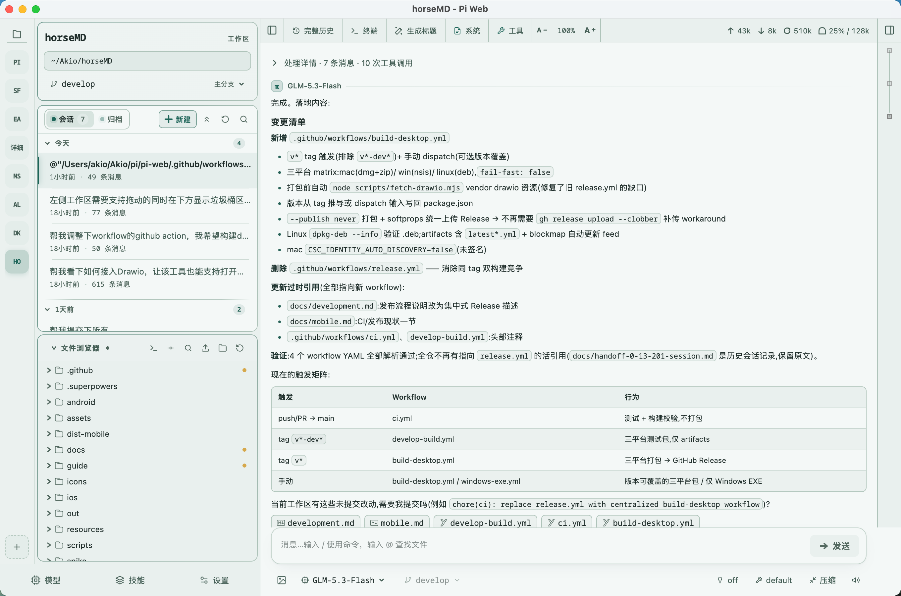
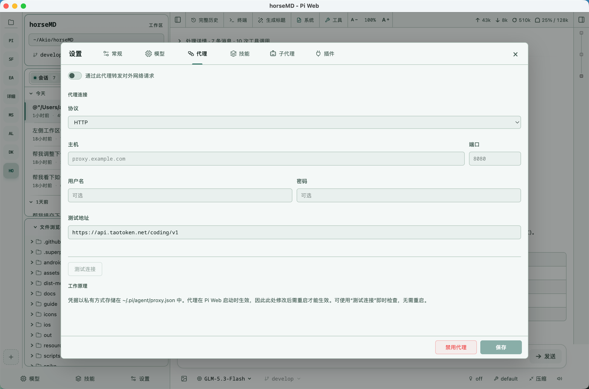
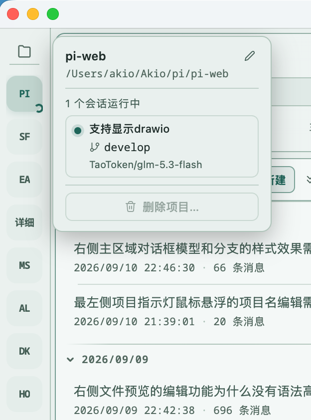
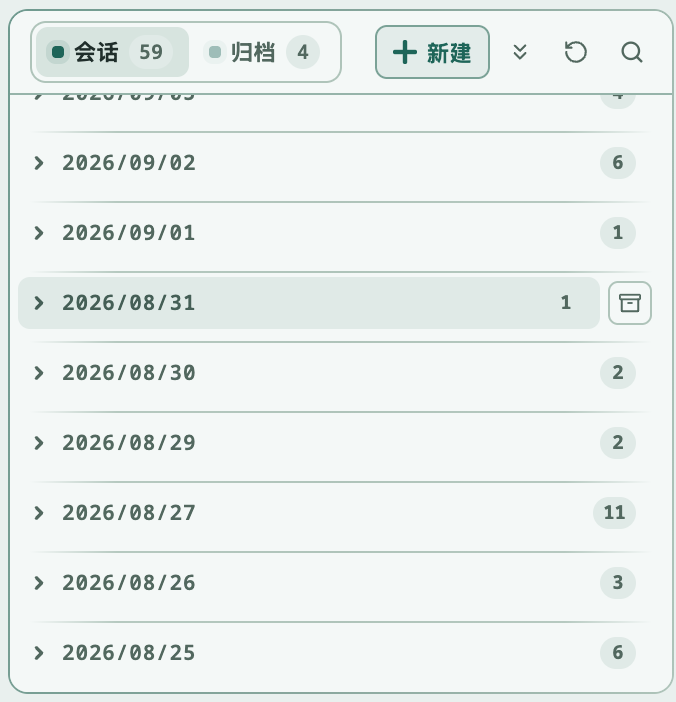
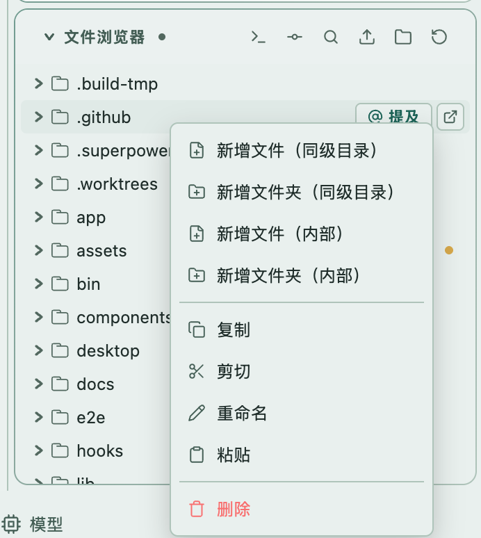
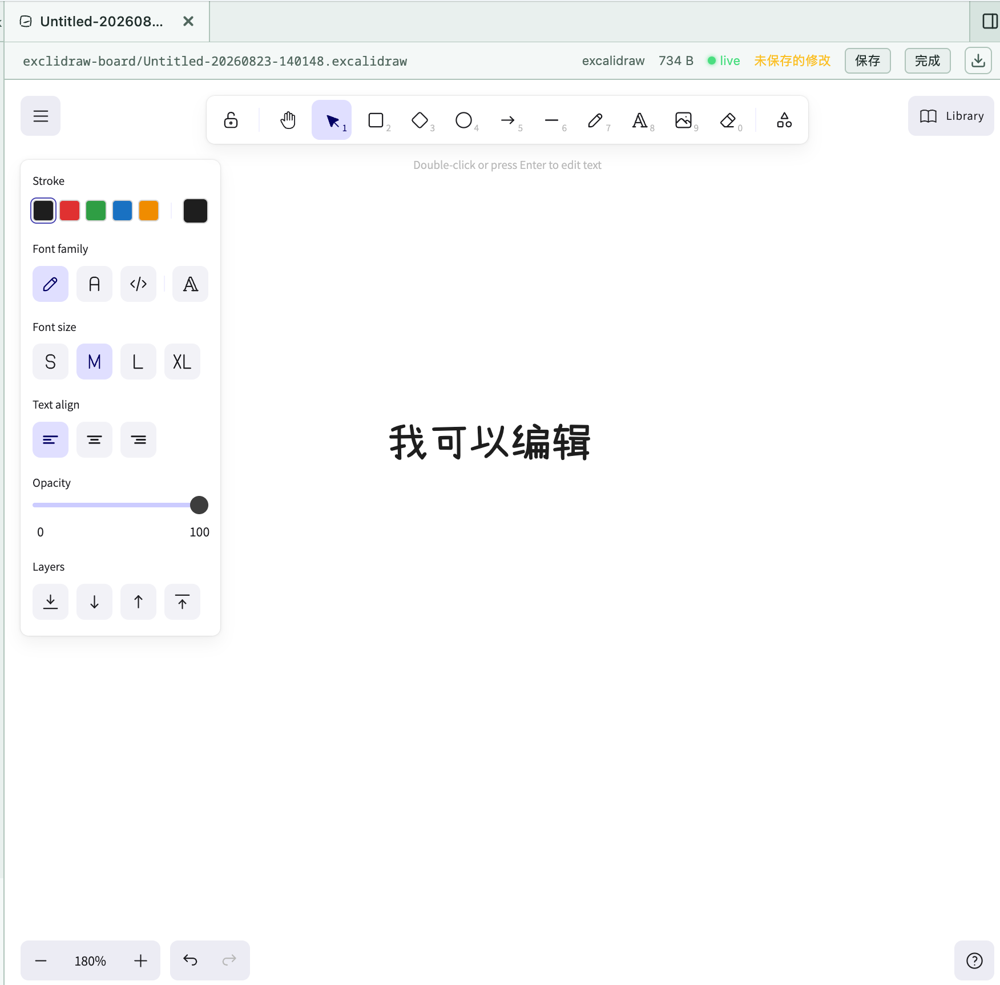

# Desktop

基于 [pi-web](https://github.com/agegr/pi-web) 构建的桌面端应用，为 [pi coding agent](https://github.com/earendil-works/pi) 提供原生桌面界面。上游原版说明见 [README_Original/README.md](./README_Original/README.md)。

本项目以 pi-web 为基础进行构建，并会**持续更新、集成 pi-web 上游的核心功能**：每当上游发布新能力，我们都会跟进合入，保证桌面端与上游体验一致。

在上游基础上，本项目新增了 **Tauri / Electron 桌面端**、**代理（Proxy）支持**，并对**整体 UI 与文件管理体验**做了大量改进。

**[Try the interactive demo →](https://agegr.github.io/pi-web/)** The real Pi Web UI runs entirely in your browser, with sample sessions, files and models. There is nothing to install; replies are pre-written and no model is called.


| 整体页面<br /> | 代理配置<br /> |
| ------------------------------------------------------------ | ------------------------------------------------------------ |
| 项目快捷切换指示灯 | 支持会话归档<br /> |
| 支持文件浏览器右键功能<br /> | 支持exclidraw显示编辑、支持文本文件编辑显示<br /> |
|                                                              |                                                              |


## 本分支的增强

### 🖥 桌面端（Tauri + Electron 双壳）

仓库同时提供两套桌面壳：Tauri 版（`src-tauri/`，推荐）与 Electron 版（`desktop/`），架构一致——**Node 服务器进程 + 本地 HTTP UI，壳只负责窗口与系统集成**。前端通过 `lib/desktop-bridge.ts` 运行时检测自动适配。

- **一键启动**：桌面端自动拉起内嵌的 `pi-web` 服务器；若同端口已有运行中的服务器则直接复用，多窗口 / CLI 与桌面端可共存。
- **运行状态指示**：系统托盘图标实时显示会话运行状态，Electron 版另支持 macOS Dock 呼吸点指示。
- **原生集成**：会话行右键弹出原生菜单（打开终端、删除会话等），删除前有原生确认对话框。
- **打包分发**：Tauri 通过 `cargo tauri build` 打包（官方 Node 二进制作 sidecar，体积显著小于 Electron）；Electron 通过 `electron-builder` 打包 macOS（dmg）、Windows（nsis）、Linux（AppImage）。Tauri 版细节见 [src-tauri/README.md](./src-tauri/README.md)。

### 🌐 代理（Proxy）支持

为内网 / 需要代理访问模型网关的环境提供完整的代理能力：

- **应用内代理设置**：在设置面板中配置代理协议（HTTP / HTTPS / SOCKS5）、地址、端口、认证信息以及 `NO_PROXY` 跳过列表，并支持一键**连接测试**。
- **全局生效**：服务端所有模型与 API 请求通过统一的 undici dispatcher 走代理，无需逐个改环境变量。
- **配置持久化**：代理配置保存在 `~/.pi/agent/proxy.json`（原子写入、权限收紧），与 pi 的其他配置放在一起。
- **环境变量兼容**：仍然支持标准的 `HTTP_PROXY` / `HTTPS_PROXY` / `NO_PROXY` 环境变量。

### 🎨 界面与体验

- **多主题**：在亮色 / 暗色之外新增 Mist、Rose、Pine 等阅读友好主题，可从工具栏主题选择器切换，也支持跟随系统。
- **双桌面壳（Tauri + Electron）**：Tauri 版以官方 Node 二进制为 sidecar、Tauri 只做壳，体积显著小于 Electron 同等打包；详见 [src-tauri/README.md](./src-tauri/README.md)。
- **文件查看 / 编辑**：编辑模式改用 CodeMirror 6，带语法高亮、查找替换和编辑器行内的变更指示；大文本文件分页预览。
- **Excalidraw 支持**：直接在 Pi Web 中查看和编辑 `.excalidraw` 白板文件（查看 / 编辑双模式）。
- **文件管理增强**：文件浏览器支持新建 / 重命名 / 删除、剪贴板复制粘贴、拖拽上传，以及从系统文件浏览器打开文件。
- **项目侧栏**：项目栏右键菜单、项目重命名（显示别名）、按项目批量删除会话。
- **细节打磨**：会话历史显示绝对时间戳、输入栏显示当前 Git 分支、聊天输入支持拖拽路径引用等。

## 已集成的上游核心功能

- **会话工作区**：按项目浏览、继续、重命名、导出和删除对话，显示运行状态、上下文占用、花费与压缩信息。
- **两种分支方式**：**新会话**从较早消息创建独立会话文件；**从此处编辑**在当前会话内创建分支。
- **项目文件工具**：浏览与上传文件、查看 Git Diff，预览源码、Markdown、图片、音频、PDF 和 DOCX。
- **Git worktree**：从侧边栏切换 checkout，同一仓库的会话自动归组。
- **网页配置**：管理 Provider 登录与 API Key、模型、模型测试、插件包及技能。
- **多语言界面**：英文、简体中文、繁体中文、日文、俄文。

## 快速开始

Pi Web 需要 Node.js 22.19.0 或更新版本。

**Web 模式**（仅浏览器）：

```bash
npx @agegr/pi-web@latest
```

**桌面端**（Tauri，推荐）：

```bash
git clone https://github.com/Grant-Vranes/pi-web.git
cd pi-web
npm install
```

**Tauri 开发模式**（两个终端）：

```bash
# 终端 1：Next dev server（Tauri 窗口指向 http://127.0.0.1:30141）
npm run dev

# 终端 2：Tauri 壳（dev 模式下 Rust 直接 spawn node bin/pi-web.js）
npm run desktop:tauri
```

> 前置：Rust 工具链（`rustup` 安装）+ `@tauri-apps/cli`（已加入 devDependencies，`npm install` 即可）。

**Tauri 打包安装器**：

```bash
# 1. 构建前端 + 组装 payload + 下载官方 Node sidecar 二进制
node scripts/build-sidecar.mjs

# 2. Tauri 打包（产物在 src-tauri/target/release/bundle/ 下）
npm run desktop:tauri:build
```

> 打包要求 `src-tauri/resources/pi-web` 与 `src-tauri/binaries/pi-web-server-*` 存在（`build-sidecar.mjs` 会生成）。`node-pty` 原生模块不可交叉编译，多平台发布需在对应平台分别执行。

**Electron 桌面端**（双壳并存，前端通过 `lib/desktop-bridge.ts` 运行时自动检测）：

```bash
# 开发模式（Web dev server + Electron）
npm run desktop:dev

# 生产构建后运行桌面端
npm run build
npm run desktop:start

# 打包安装器（产物在 dist/ 下）
npm run desktop:dist
```

> **Linux 打包提示**：若 `/tmp` 是小容量 tmpfs，`electron-builder` 的 fpm 步骤可能报 `Disk quota exceeded (EDQUOT)`。可将临时目录重定向到磁盘路径：
>
> ```bash
> TMPDIR=$(pwd)/.build-tmp npm run desktop:dist
> ```
>
> `.build-tmp/` 已在 `.gitignore` 中。

## 配置

命令行参数优先于环境变量。`--no-open` 或 `PI_WEB_NO_OPEN=1` 可禁止自动打开浏览器；`pi-web --help` 打印启动选项。

| 参数 / 环境变量 | 作用 | 默认值 |
| --- | --- | --- |
| `--port <port>`、`-p` 或 `PORT` | 服务器端口 | `30141` |
| `--hostname <host>`、`-H` 或 `PI_WEB_HOSTNAME` | 绑定地址 | `127.0.0.1` |
| `--no-open` 或 `PI_WEB_NO_OPEN=1` | 不自动打开浏览器 | 自动打开 |
| `PI_WEB_PASSWORD` | 启用浏览器密码登录；API 客户端可用用户名 `pi` 的 Basic Auth | 不启用认证 |
| `PI_WEB_IDLE_TIMEOUT_MS` | 会话空闲超时（毫秒），`0` 表示不超时 | `600000`（10 分钟） |
| `HTTP_PROXY` / `HTTPS_PROXY` / `NO_PROXY` | 服务端请求走环境变量代理 | 未设置 |

也可以复制 `.env.example` 为 `.env.local` 固定项目本地的端口等默认值；`npm run dev`、`npm run desktop:dev`、`npm run start` 都会读取它，CLI 参数与已导出的环境变量优先。

代理也可在**应用内设置面板**配置（HTTP/HTTPS/SOCKS5、认证、NO_PROXY、连接测试），保存到 `~/.pi/agent/proxy.json` 后对所有服务端请求生效。

### 远程访问安全提示

绑定非回环地址会暴露一个可以执行高权限操作的智能体。在可信局域网中请设置强密码：

```bash
PI_WEB_PASSWORD='a-long-random-password' pi-web --hostname 0.0.0.0
```

密码认证不加密连接，请不要将 Pi Web 以明文 HTTP 暴露到公网；请通过可信反向代理或 VPN 提供 HTTPS。

## 开发

```bash
npm install
npm run dev
```

开发服务器默认运行在 [http://127.0.0.1:30141](http://127.0.0.1:30141)，也可用 `.env.local` 的 `PORT` 覆盖。常用检查：

```bash
npm test
node_modules/.bin/tsc --noEmit
npm run lint
```

日常开发不要运行 `next build` / `npm run build`（会写入 `.next/` 干扰开发服务器），构建留给发布流程。

## 仓库结构

```text
app/             Next.js UI 与 API 路由
components/      React UI 组件
hooks/           客户端状态与交互 hooks
lib/             会话、智能体、模型、文件、Git、代理与安全逻辑
desktop/         Electron 桌面端封装（托盘 / Dock 指示、原生菜单）
src-tauri/       Tauri 桌面壳（sidecar Node 服务器 + 托盘 + 原生菜单）
bin/             npm CLI 入口与启动参数解析
public/          静态资源与 PWA 文件
docs/            用户与贡献者文档
demo/            Static browser demo published to GitHub Pages (see demo/README.md)
```

架构细节与文件地图见 [AGENTS.md](./AGENTS.md)；上游原版 README 见 [README_Original/README.md](./README_Original/README.md)。

## License

[MIT](./LICENSE)
